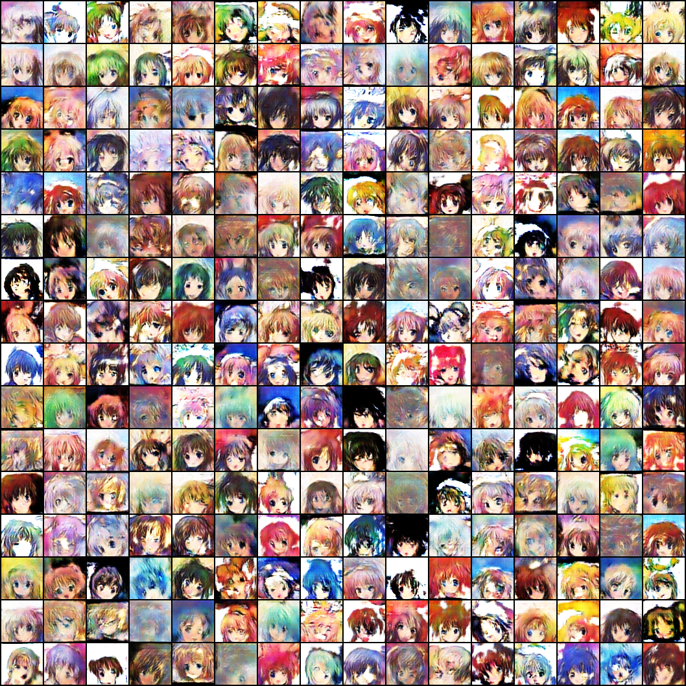

# GANs

A simple frame for training several GANs with pytorch on different Datasets.

Models Available:

- [x] Vanilla GAN： MLP + Vanilla Loss.
- [x] DCGAN: DCGAN + Vanilla Loss.
- [x] WGAN: DCGAN + weight clipping + WGAN Loss.
- [x] WGAN-GP: DCGAN + gradient penalty + WGAN Loss.
- [x] LSGAN: DCGAN + LS Loss.

Dataset Available:

- [x] MNIST
- [x] CIFAR-10
- [x] [AnimeFaces](http://www.nurs.or.jp/~nagadomi/animeface-character-dataset/)


## Usage

1. Training 

Training models with prepared models and dataset. 

```
python train.py [model] [dataset] --data-root [data-root]
```

2. Inference

```
python inference.py --read-save-root [save-root]
```

- `save-root` specify the record folder saved in training process.

I also provide a way to show tranistion images:
```
python inference.py --read-save-root [save-root] --show-transition --transition-number [tnumber]
```

3. Continue Training

Continuing your training based on thosed already trianed ones.

```
python train.py [model] [dataset] --data-root [data-root] --continue-training --read-save-root [saved-path]  --save-root [save-root]
```

- `save_path` specify the folder containing the trained models.

- I suggest to use `save-root` to specify a new folder to save training record and  avoid overriding the record before.

- Attention that **there might be conflict settings between that in continuing training and in before training.** This might lead to some problems when loading the trained models, so when encoutering this problem, please check the conflict setttings (especially those about models) at first. Mind the settings of continuing training would be used priorly. 


## Training Record

1. WGANGP on AnimeFaces, trained 400 epochs.



The generated images lose some fine details, but do not show mode collapse. More training steps would help. The pre-trained `--read-save-root` is `save/wgangp_anime/`


## Reference

- DCGAN: [Unsupervised Representation Learning with Deep Convolutional Generative Adversarial Networks](https://arxiv.org/pdf/1511.06434)
- WGAN: [Wasserstain Generative Adversarial Networks](https://arxiv.org/pdf/1701.07875)
- WGAN-GP: [Improved Training of Wasserstain GANs](http://papers.nips.cc/paper/7159-improved-training-of-wasserstein-gans.pdf)
- LSGAN: [Least Squares Generative Adversarial Networks](http://openaccess.thecvf.com/content_ICCV_2017/papers/Mao_Least_Squares_Generative_ICCV_2017_paper.pdf)