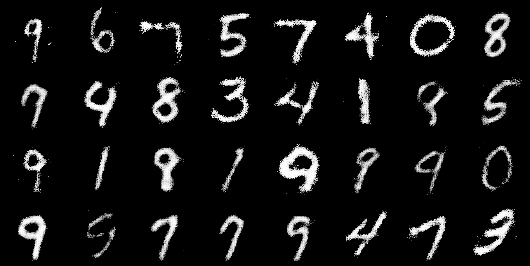
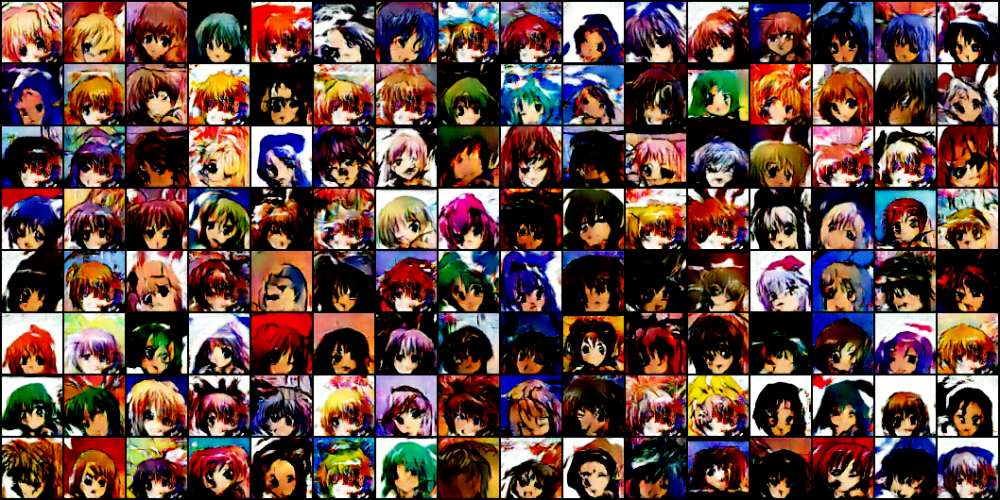
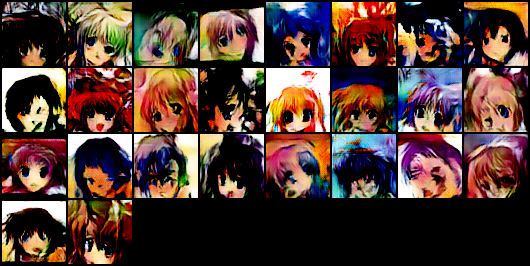

# GANs

Implementation of serveral GANs with pytorch:

- [x] Vanilla GAN (with MLP)
- [x] DCGAN
- [x] WGAN
- [x] WGAN-GP
- [ ] SA-GAN (Attention)
- [ ] cGAN

Related work:

- [ ] Evaluation methods of GAN.
- [ ] Better Visiualization.
- [ ] TensorBoardX logging.

## Training Record

| model | lr_G | lr_D | epochs | methods | dataset |
| -- | -- | -- | -- | -- | -- |
| MLP | 0.0002 | 0.0002 | 40 | Adam betas = (0.5, 0.999) | MNIST |
| DCGAN | 0.0002 | 0.0002 | 200 | Adam betas = (0.5, 0.999) | AnimeFaces |
| WGAN | 5e-5 | 5e-5 | 50 | RMSprop | AnimeFaces |
| WGAN-GP | 1e-4 | 1e-4 | 200 | Adam betas = (0,0.9), $\lambda=10$ | AnimeFaces |

## Problems Record

- It's a little strange to fail to train the WGAN(Weight-Clipping ver), the generator worked at first and learned some features like shape, but after a while, the generator seemingly could not improve anymore, **the generated images often lack details and structure**, and **the Wasserstain Distance preserve at the same level**. (2019.12.19)

   The problem get improved after training WGAN for more epochs, but it converge slower than vanilla training methods. 

## Training Examples

Better Training results will be updated.

- 3-layers MLP on MNIST:

   

- DCGAN on AnimeFaces: (No mode collapse) 

   

- WGANGP on AnimeFaces

   

## References

- [AnimeFace-Character-dataset](http://www.nurs.or.jp/~nagadomi/animeface-character-dataset/)
